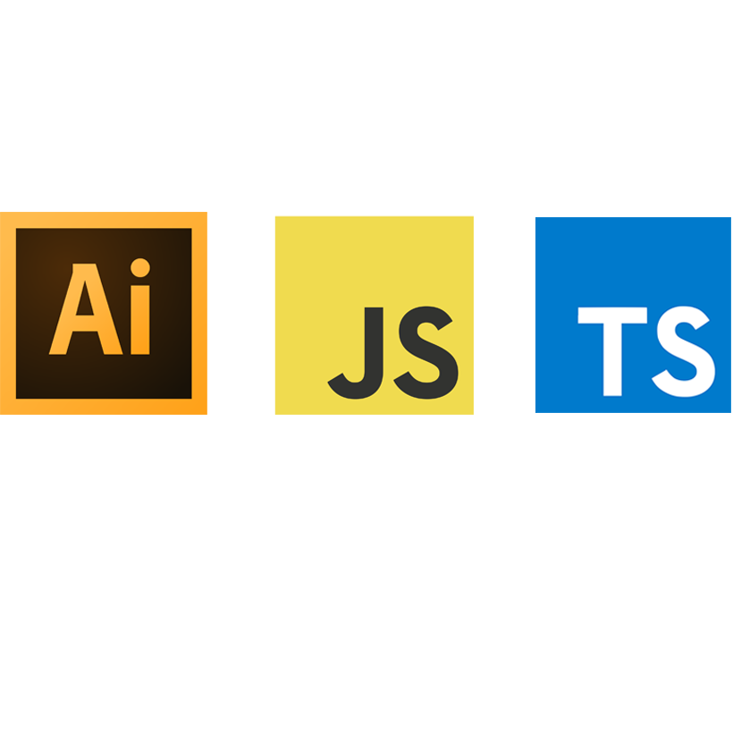

<div id="top"></div>
<!-- PROJECT LOGO -->
<br />
<div align="center">
  <a href="">
    
  </a>

<h3 align="center">A Typescript file that converts into ECMA 3 target JS file for use in Adobe Illustrator 2022. JS script that takes 2 icons on 2 artboards @256x256 and exports them into a variety of banners and formats, including company logo and text.</h3>

  <p align="center"> 
    Useful links 
    <br />
    <a href="https://github.com/Artchibald/WTW_107405_product_logo_template_script"><strong>Explore the docs »</strong></a>
    <br />
    <br />
    ·
    <a href="https://github.com/Artchibald/WTW_107405_product_logo_template_script/issues">Report Bug</a>
    ·
    <a href="https://github.com/Artchibald/WTW_107405_product_logo_template_script/issues">Request Feature</a>
        ·

  </p>
</div> 

<!--# Ref for email comms

 Subject >>>
WTW_55556_Software Product Icons

cc' >>>
 rrdcreativeldn @willistowerswatson.com

# 2022_icon_rebrand_scripts -->

# Video tutorial

https://youtu.be/yxtrt7nkOjA

# This is v2 2023

The original script was https://github.com/Artchibald/2022_icon_rebrand_scripts

# Instructions

- This script only works locally not on a server.
- Don't forget to change .txt to .js on the script.
- FULL README: https://github.com/Artchibald/WTW_107405_product_logo_template_script  
- Video set up tutorial available here: https://youtu.be/yxtrt7nkOjA.
- Open your own .ai template or the provided ones in folders called all_scripts_here.
- In Illustrator, go to to file > Scripts > Other Scripts > Import our new script.
-  Make sure you have the graphik-regular and graphik-bold font installed on your CPU. 
- You must have the folder called images in the parent folder, this is where wtw_logo.ai is saved so it can be imported into the big purple banner and exported as assets. Otherwise you will get an error that says "error = svgFile".
- Illustrator says (not responding) on PC but it will respond, give Windows some time, on a 2017 Macbook this script runs under 5 minutes.
- If you run the script again, you should probably delete the previous assets created. They will be overriden. 
- Both artboard sizes must be exactly 256px x 256px. 
- Guides must be on a layer called exactly 'Guidelines'. 
- Icons must be on a layer called exactly 'Art'. 
- Make sure all layers are unlocked to avoid bugs. 
- Exported assets will be saved where the .ai file is saved. 
- Please try to use underscore instead of spaces to avoid bugs in filenames. 
- Make sure you are using the correct swatches/colours. 
- Illustrator check advanced colour mode is correct:  Edit > Assign profile > It should match sRGB IEC61966-2.1.
- Select each individual color shape and under Window > Colours, make sure each shape colour is set to rgb in tiny top right burger menu if bugs encountered.
- If it does not save exports as intended, check the file permissions of where the .ai file is saved (right click folder > Properties > Visibility > Read and write access? Also you can try "apply permissions to sub folders too" if you find that option)
- Please do not use the Graphik font in any other projects without permission, this is a copyrighted font, therefore not included in this repo.  

- NEW! All colours including the patterns must be set as RBG colours not CMYK. If you run this script with CMYK colors, it is possible the conversions won't work correctly.
- NEW! Make sure that all the vectors that compose your artwork are not hidden and larger than your 256x256 board. Use the Intersect path finder tool to crop hidden pattern vector areas.

- Any issues: archie ATsymbol archibaldbutler.com.


# Run watch task to compile ts to js

run "npm i" to get node_modules

"npm i types-for-adobe" make sure we have this node module.

tsc -p /NAVIGATE_TO_CODEBASE_FOLDER/tsconfig.json --watch  
 
Or VS code main top nav menu > Terminal > Run Build Task > Watch

# Script overview

- First we have global variables
- Some setup tasks such as folder creation and text prompts
- The prompts will ask for text for various places
- Then reusable fuctions with a typescript interface for easier debugging
- Then the script is split into 5 functions for 5 artboard. 2 originally and 3 created currently. 
- We target the different artboards using their positions in the array of 5 artboard (0,1,2,3,4,)
- There are code sections where we duplicate in a new artboard, save out exports, then close the new artboard. In this scenario the array of artboards will always be 0, whereas main doc has 2 artboards, 0 and 1, but also artboards, 2, 3 and 4 get created halfway down the script. This can be consfusing. If you see artboard[0].width = 512 You are probably in a section of the code that is working on a duplicated new file, not the main file.
- Script to automate creating variations and exporting files for WTW icons
- Starting with an open AI file with two single icons on 2 256 x 256 artboards
- Exports artboards[0] in a new file (core)
- Exports artboards[1] in a new file (expressive pattern)
– Creates a new artboards[2] with core icon and text then duplicates in a new file and exports
- Creates a new artboards[3] (purple banner) with expressive icon and exports from a new file
- Creates a new artboards[4] with core icon and larger regular text and exports from a new file

- Creates exports of the icon using both artboards[0] Core and artboards[1] Expressive:
- RGB EPS
- RGB inverse EPS
- RGB inactive EPS
- PNGs at 1024, 256, 128, 64, 48, 32, 16
- RGB masthead 
- CMYK EPS
- CMYK inverse EPS

They get exported to a variety of folders where the icon is saved.

- The script copies a selected artboard and duplicates the current selection and pastes in a new file, saves some exports and closes the 2nd file multiple times throughout. You would want to duplicate these chunks for new functionality.

From
```
 let someDoc = CSTasks.duplicateArtboardInNewDoc(
      sourceDoc,
      3,
      DocumentColorSpace.RGB
   );
```

To
```
   //close and clean up
   someDoc.close(SaveOptions.DONOTSAVECHANGES);
   someDoc = null;
```

# Consideration

You must have a purple portion of your original icons or the invert to whites wont work and will skip. At the end of this project, it is possible we add more colours for the invert, but this needs to happen after amends, because of duplication.

Make sure your file colour mode is RGB.

Make sure that all the colours in the expressive stripe are set to RGB otherwise the script will have trouble with CMYK colour conversion.

Make sure the dark colours of the expressive stripe are expanded under Object > Expand. The dark stripes width and height must not go beyond 256x256. Sometimes it makes it a large background square. This needs to be resolved first: 


[![stripes][stripes]](https://github.com/Artchibald/WTW_107405_product_logo_template_script)

[stripes]: images/stripes.jpg 

As per above image you may need to use the pathFinder intersect option to crop out the extra stripe areas.  

# Strict mode

Around line 554, removing this return may help with debugging.

```
		if (unmatchedColors.length > 0) {
			// NOTE: Do not perform the Artboard Creation Work if there are unmatched colors due to new palettes CMYK and RGB no longer matching.
			return;
			alert(
				"One or more colors don't match the brand palette and weren't converted."
			);
```

If you enable strict mode by removing the return from convertTo CMYK, all colors must be referenced in the array.

```
// make a rect and fill it with color (darkPurpleIndex) from position 12 of the CMYK array, RGB is 0, CMYK, is 1:
let mainRectMastDocCMYK = GetMyMainPurpleBgLayerMastDocCMYK.pathItems.rectangle(
		-784,
		0,
		1024,
		512);

	mainRectMastDocCMYK.filled = true;
	mainRectMastDocCMYK.fillColor = colors[darkPurpleIndex][1];
```

If you use new colors that are not taken from the array of brand colors you will get "unconverted colors: X,X,X or undefined,undefined,undefined" if you remove the return in the reusable functions. Depending on how you declare your new color. Use the colors from the main 2 rgb and cmyk arrays where possible.

# Script is 5 distinct blocks

- Script starts with global var declarations, standard.
- Then reusable interface with reusable functions.
- Then all the Core exports (sourceDoc.artboards[0].XXXX)
- Then all the expressive exports (sourceDoc.artboards[1].XXXX)
- Extra note: I noticed "let = colorIndex" is needed for CMYK conversions, be sure it is declared in the previous new doc rgb block, but after the function convertToRGB or cmyk invert further on, does not work. You may use the app shortcut colors8 and colors9. These will try to select and set all the colors to rgb or cmyk depending. Ref: https://ten-artai.com/illustrator-ccver-22-menu-commands-list/

# Font issues

Font type must be TT (truetype), doesn't work with O (opentype)

# 1 off bug when updating Illustrator

After updated Illustrator, it couldn't read wtw_logo.ai, so one opens that file in Illustrator, saves it, run the script again and it works.

 # Illustrator Edit > Assign profile > Must match sRGB IEC61966-2.1 or it won't work

 # Select each individual colour shape and under Window > Colours make sure each shape colour is set to rgb in burger or main menu or it may not work as expected!

 # Presentation question what would be liked for folder structure

 # Blockers

Amends undergoing

 # Issue with swatches stopping colours being RGB, trying  Edit > Edit colors > Convert to RGB

- managed to fix with    // make sure all colors are RGB, equivalent of Edit > Colors > Convert to RGB

```
   app.executeMenuCommand('Colors9');
```

- The list of all these available commands can be useful for a specific task: https://community.adobe.com/t5/illustrator-discussions/a-list-of-illustrator-menu-commands-we-can-call-from-javascript/td-p/7694367


# Briefs and other less important notes

# To do

- Change svg dimensions in their respective code?
- Do we move our resize functions into reusable section at top of script?

# Done

- Create folders for all SVG, EPS, JPG,PNG and try to save them in the right place
- Find bug: One or more colours....
- let tasks: any = {}; line 83, better solution than any?
- Is there a way to edit the viewbox 256 settings in each svg?
- Convert to CMYK breaking script, not working colours undefined
- Inverse action works with old colours not new ones
- do cropped 16 + 24
- documentation - reusability for other devs
- DONE CMYK and RGB don't match this time round! We blocked with a commented return.

# Initial call brief

New set up for the original script to undergo some formatting changes. Original v1 of this repo: https://github.com/Artchibald/2022_icon_rebrand_scripts

# TUBS

# Add swatch to your swatches panel before starting with swatch .ai file. Swatch menu > Other Library..., ask design team for these swatches if you do not have them.

# New action for pattern form Diane and Chris, see chat and discuss on call

# New amends 

[![explain][explain]](https://github.com/Artchibald/WTW_107405_product_logo_template_script)

 
[explain]: images/explain.png